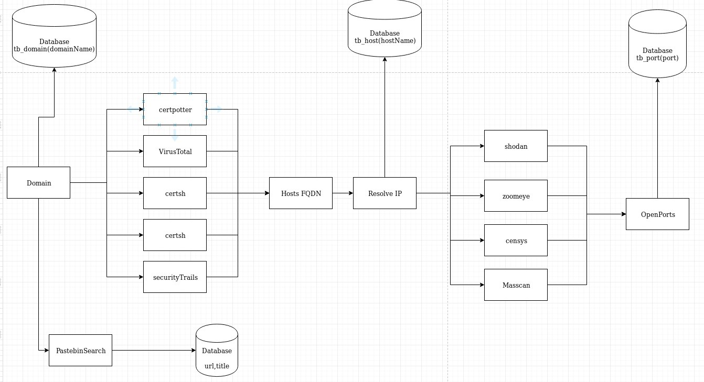

## Passive Recon Tool 
This tool use few API's to grab data from domains.
Passive scan
Active scan
Search for relative data in AWS and Pastebin
someday far way i will write a pretty cool readme, but not today guys


## How it works?
I draw someshit here, it is outdated anyway, i will update after I finish some code stuff


### Python3 Requirement 
- PyMySQL
- shodan
- json
- threading
- os
- time
- requests
- BeautifulSoup
- subprocess

### Required Programns
- masscan
- mariadb-server 10.3.20-MariaDB


### Instalation: 
```
git clone https://github.com/d34dfr4m3/prettycool.git
cd prettyCool/install
sudo ./install.sh #and pray a while
```

### Configuration: 
Edit the file tools/report_maker.py and set the password: 

```
def createCon():
  connection = pymysql.connect(host='localhost',
                             user='prettycool',
                             password='',
                             db='db_data',
                             charset='utf8mb4',
                             cursorclass=pymysql.cursors.DictCursor)
  return connection 
```

Edit the file tools/db_controler.py and set the password: 

```
def createCon():
  connection = pymysql.connect(host='localhost',
                             user='prettycool',
                             password='',
                             db='db_data',
                             charset='utf8mb4',
                             cursorclass=pymysql.cursors.DictCursor)
  return connection 
```

#### Data Sources:
- Shodan: Used to get services at hosts. (https://api.shodan.io)
- Censys: Used to get services at hosts. (https://censys.io)
- Crt.sh: Used to enumerate hosts from domain and subdomains. (https://crt.sh)
- Certspooter: Used to enumerate hosts from domain and subdomains (https://certspotter.com)
- VirusTottal: Used to enumerate hosts from domain and subdomains. (https://www.virustotal.com)
- SecurityTrails: Used to enumerate hosts from domain and subdomains. (https://api.securitytrails.com)
- Spyse Used to get hosts from domain and ports from hosts (https://api.spyse.com/)
- psbdmp.ws: Search cross a indexes pastebin urls into a open database or someshit like that (https://psbdmp.ws)
- GreyHatWarfare: Search for buckets s3 (https://buckets.grayhatwarfare.com/)

#### Tools for active recon
- masscan

## ToDO
- SANITIZAR TODOS OS INPUTS PRO BANCO DE DADOS, alguns valores estãop quebrando
- Criar uma tabela para os arquivos do bucket da AWS
- Problema no censys refrente à identificar portas ativas no servidor de proxy reverso da aplicação caso esteja em um serviço tipo AWS. 
- Refatorar o código. 
- Analisar estrutura dos dados e armazenamento.
- Verificar doc do Shodan e trabalhar melhor os dados.
- healthCheck do SecurityTrails. 
- Criar uma pool de keys de API caso uma queime.
- integrar zoomeye para descoberta de hosts e serviços.
- Escrever output em arquivo.
- Adotar multithread e alterar o fluxo de execução do programa visando melhorar o desempenho.
- Tunning de masscan, ler documentação e aperfeiçoar o scanner setando flags de tunning. 
- Refatorar -> Reescrever chamadas de API, centralizar em um lugar só e criar métodos pra cada API ao invez de ficar trocando URL. 
- Substituir OS por subprocess.
- Database deploy, verificação de dados se existem no banco de dados antes de pesquisar Dominios, IPS, implementar um timestamp dos dados, a partir de X tempoo o valor do banco expira e precisa ser scaneado novamente. 
- Integrar com https://dns.bufferover.run/dns?q=domain_name
- Integrar com https://dnsdumpster.com
- randomizar useragent
- Colocar função global de http status code 
- Pesquisar no grayhatwarfare por nomes em arquivos.
- REPORT -> Separar hosts com IP e apenas enumerar hosts sem IP
- Resultado do masscan não está sendo inserido no fucking banco de dados porra caralho.
- Pastebin n adiciona, erro ->Pastebin error: (1062, "Duplicate entry 'glbimg.com' for key 'fk_dump_domain1_idx'") Fucking PK configurada errada, porra
- Integrar com Amass(?)
- Github Search 
- Adotar https://ipinfo.io/
- Adotar print das páginas ScreenShot https://github.com/maaaaz/webscreenshot


##### WayBackMachine 
- https://github.com/tomnomnom/waybackurls 

### Maybe put in the project
- honeypot checker from shodan

##### Footprint DNS IP / Network
- Virtual host scanner https://github.com/jobertabma/virtual-host-discovery
- Asnlookup https://github.com/yassineaboukir/asnlookup
- SpoofCheck https://github.com/BishopFox/spoofcheck
- Just-metadata https://github.com/FortyNorthSecurity/Just-Metadata

##### Web Recon 
- JSParser https://github.com/nahamsec/JSParser
- Aquatone https://github.com/michenriksen/aquatone

##### AWS S3 Bucket
- Teh S3 Bucketeers https://github.com/tomdev/teh_s3_bucketeers
- Lazys3 https://github.com/nahamsec/lazys3
- AWSBucketDump https://github.com/jordanpotti/AWSBucketDump

##### OSINT 
- Datasploit https://github.com/DataSploit/datasploit
- pwnedOrNot https://github.com/thewhiteh4t/pwnedOrNot
- pwndb https://github.com/davidtavarez/pwndb/
- LinkedInt https://github.com/vysecurity/LinkedInt
- CrossLinked https://github.com/m8r0wn/CrossLinked
##### Github
- unfurl https://github.com/probot/unfurl
- truffleHog https://github.com/dxa4481/truffleHog


### Usefull:
- https://github.com/infosecn1nja/Red-Teaming-Toolkit#reconnaissance
- https://pentester.land/conference-notes/2018/07/25/bug-bounty-talks-2017-automation-for-bug-hunters.html
- https://developer.shodan.io/api
- https://censys.io/api
- https://securitytrails.com/corp/api
- https://github.com/screetsec/sudomy
- https://www.zoomeye.org/doc
- User Database permissions: https://www.digitalocean.com/community/tutorials/how-to-create-a-new-user-and-grant-permissions-in-mysql
- https://dev.mysql.com/doc/refman/5.7/en/mysql-secure-installation.html
- https://www.w3schools.com/sql/sql_foreignkey.asp
- https://github.com/robertdavidgraham/masscan
